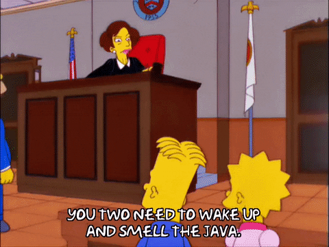

### Hey there! I am Shaifil Maknojia
  
 

🎯 **Portfolio website:** [https://saifilmaknojia.github.io](https://saifilmaknojia.github.io/)

#### :pushpin: Things I enjoy

- Coding in Java :coffee:
- Backend Development :desktop_computer:
- Personal Finance and Investing :money_with_wings:
- Travel :national_park:
- Data Analytics :bar_chart:
- Reading 📖

#### :man_technologist: **Tech Stack**

 

